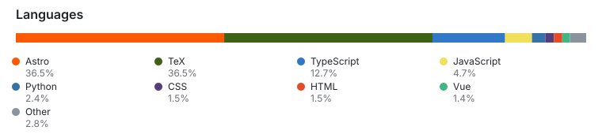

# Gustav Beier

Frontend engineer focused on React + TypeScript, building scalable UI systems and reliable digital products.

### Core

**Focus:** UI architecture · UX · performance · API integration · process automation

**Projects:** Python · OCR pipelines · LLM tooling · Ollama

### Languages

<picture>
  <source media="(prefers-color-scheme: dark)" srcset="./assets/languages-dark.svg">
  
</picture>

🌐 [gustavbeier.xyz](https://gustavbeier.xyz)
